  

  

  <em>Cloud Engineer focused on secure, observable, and highly available infrastructure. Engineering precision at scale.</em>

 

| **Cloud & Infrastructure** | **Observability & Data** | **Development & Security** |
| :--- | :--- | :--- |
|  |  |  |
|  |  |  |
|  |  |  |

 

## ✦ Technical Metrics

  

  
  

 

## ✦ Selected Work

| Project | Outcome |
| :--- | :--- |
| **[terraform-landing-zone](https://github.com/harrison-vc/terraform-landing-zone)** | Modular, secure enterprise AWS baseline with OIDC & tfsec. |
| **[cloud-operations-runbook](https://github.com/harrison-vc/cloud-operations-runbook)** | Standardized response protocols for high-availability systems. |
| **[systems-debugging-framework](https://github.com/harrison-vc/systems-debugging-framework)** | Structured checklists for rapid RCA in distributed environments. |

 

## ✦ Professional Connect

  
  
  

---

  Generated with precision. © 2026 Harrison Vance.

